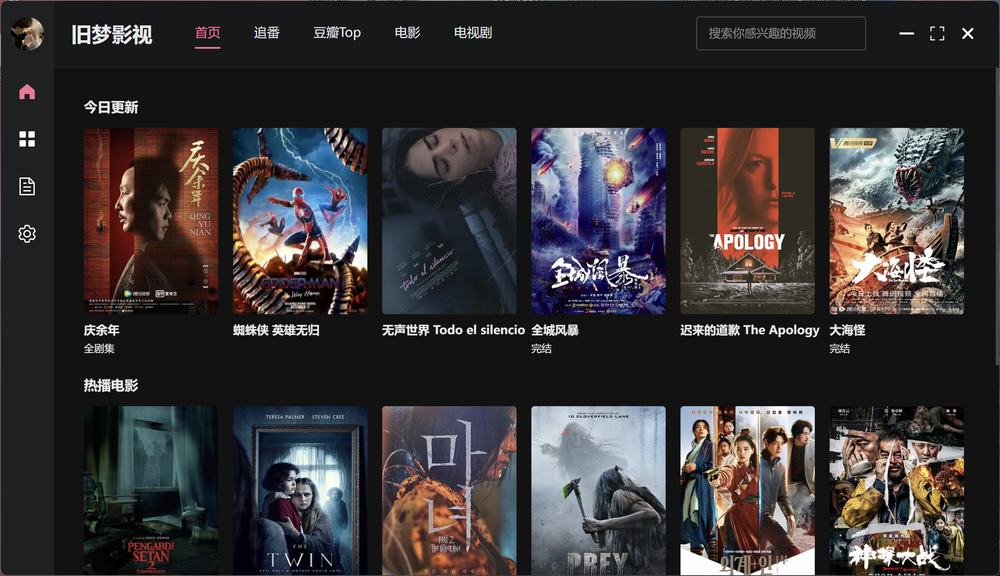
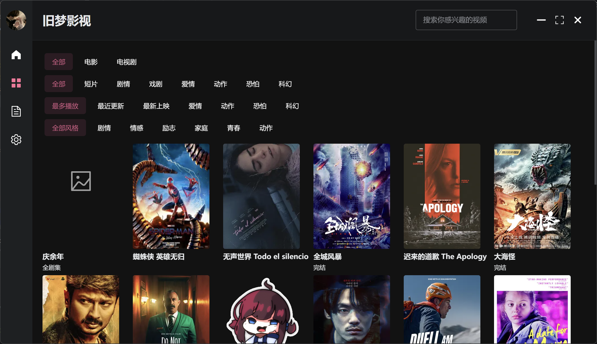
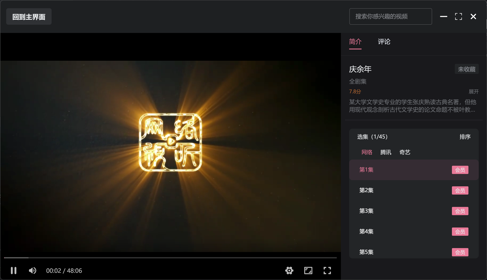

# 旧梦影视 桌面端

electron_vite_vue_cms_desktop

## 项目介绍
- 后端：苹果cmsV10、apptoV3插件（感谢@appto大佬的开源项目）等
- 前端：electron-vite、element-plus、vue-router等

## 推荐的IDE设置

- [VSCode](https://code.visualstudio.com/) + [ESLint](https://marketplace.visualstudio.com/items?itemName=dbaeumer.vscode-eslint) + [Prettier](https://marketplace.visualstudio.com/items?itemName=esbenp.prettier-vscode) + [Volar](https://marketplace.visualstudio.com/items?itemName=Vue.volar) + [TypeScript Vue Plugin (Volar)](https://marketplace.visualstudio.com/items?itemName=Vue.vscode-typescript-vue-plugin)

## 项目搭建

### 安装依赖

```bash
$ yarn
```

### 预览

```bash
$ yarn dev
```

### 编译打包

```bash
# For windows
$ yarn build:win

# For macOS
$ yarn build:mac

# For Linux
$ yarn build:linux
```

## 预览



